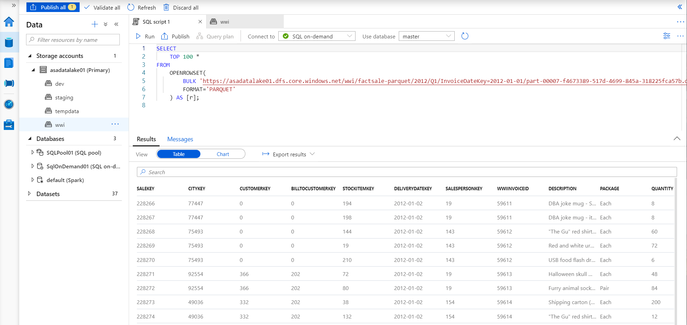
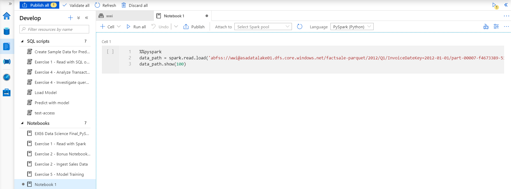

# Explore the Data Lake with Synapse SQL Serverless and Synapse Spark

In this exercise you will explore data using the engine of your choices (SQL or Spark).

Understanding data through data exploration is one of the core challenges faced today by data engineers and data scientists as well. Depending on the underlying structure of the data as well as the specific requirements of the exploration process, different data processing engines will offer varying degrees of performance, complexity, and flexibility.

In Azure Synapse Analytics, you have the possibility of using either the SQL Serverless engine, the big-data Spark engine, or both.

The tasks you will perform in this exercise are:

- Explore the Data Lake with SQL Analytics on-demand and Spark
  - Task 1 - Explore the Data Lake with SQL Analytics on-demand
  - Task 2 - Explore the Data Lake with Spark

## Task 1 - Explore the Data Lake with SQL Analytics on-demand

In this task, you will browse your data lake using SQL on-demand.

1. In a web browser, navigate to the Azure portal (`https://portal.azure.com`) and then select **Resource groups**.

   

   Select the **Synapse Analytics** resource group.

   

   Select the **Synapse Analytics** workspace.

   

2. Open Synapse Analytics Studio, and then navigate to the `Data` hub.

3. Under `Storage accounts`, expand the **Storage account** node, expand the data lake storage account, and then select the `wwi` file system.

4. Inside the selected file system, navigate to `factsale-parquet` -> `2012` -> `Q1` -> `InvoiceDateKey=2012-01-01`.

5. Right-click the Parquet file and select `New SQL script - Select TOP 100 rows`.

   > A script is automatically generated. Run this script to see how SQL on demand queries the file and returns the first 100 rows of that file with the header allowing you to easily explore data in the file.

   

6. Ensure the newly created script is connected to the `SQL on-demand` pool and then select `Run`. Data is loaded by the on-demand SQL pool and processed as if was coming from any regular relational database.

   

7. Let's change the initial script to load multiple Parquet files at once.

   - In line 2, replace `TOP 100 *` with `COUNT(*)`.
   - In line 5, replace the path to the individual file with `https://asadatalake02.dfs.core.windows.net/wwi/factsale-parquet/2012/Q1/*/*`.

8. Select `Run` to re-run the script.

   

9.  In Azure Synapse Analytics Studio, navigate to the `Develop` hub, select the `Exercise 4 - Read with SQL on-demand` SQL script, and then select `Run`.

    

> This query demonstrates the same functionality, except this time it loads CSV files instead of Parquet ones (notice the `factsale-csv` folder in the path).

## Task 2 - Explore the Data Lake with Spark

1. Navigate to the `Data` hub, browse to the data lake storage account folder `wwi/factsale-parquet/2012/Q1/InvoiceDateKey=2012-01-01`, then right-click the Parquet file and select `New notebook`.

   

2. This will generate a notebook with PySpark code to load the data in a dataframe and display 100 rows with the header.

   

3. Attach the notebook to a Spark pool and run the command.

   

   > **Note**: The first time you run a notebook in a Spark pool, Synapse creates a new session. This can take approximately 3 minutes.

4. As you can see, the output is not formatted very well. To change this, replace the last line of code with the following:

   ```python
   display(data_path.limit(100))
   ```

5. Run the notebook again to see the improved display.

   

6. Notice the included charting capabilities that enable visual exploration of your data. Select `View Options` and change the X Axis Column from `Sales Key` to `Customer Key`.

   

7. In Azure Synapse Analytics Studio, navigate to the `Develop` hub, select the `Exercise 1 - Read with Spark` notebook, and then select `Run`.

   

   > This notebook demonstrates the same functionality, except this time it loads CSV files instead of Parquet ones (notice the `factsale-csv` folder in the path).

8. Close all open tabs in Azure Synapse Analytics Studio, choosing to discard changes when prompted.
