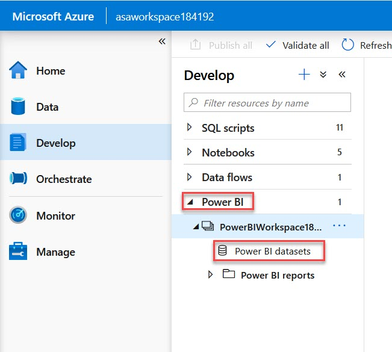
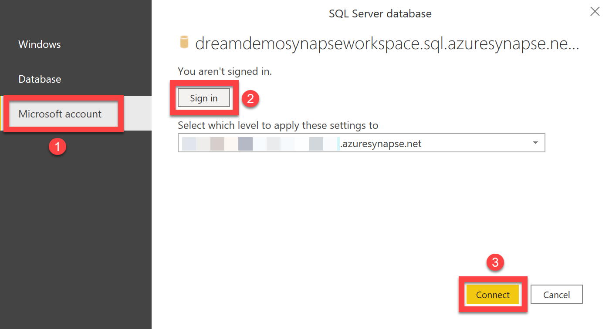
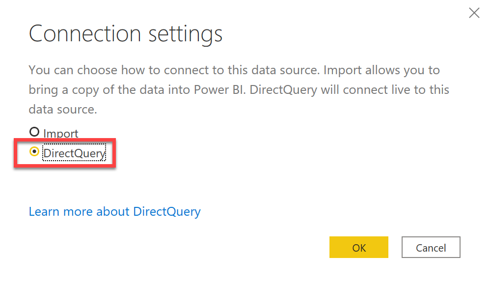
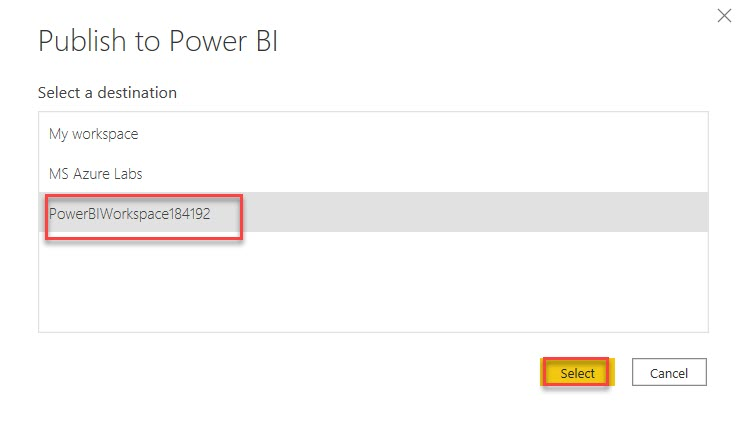
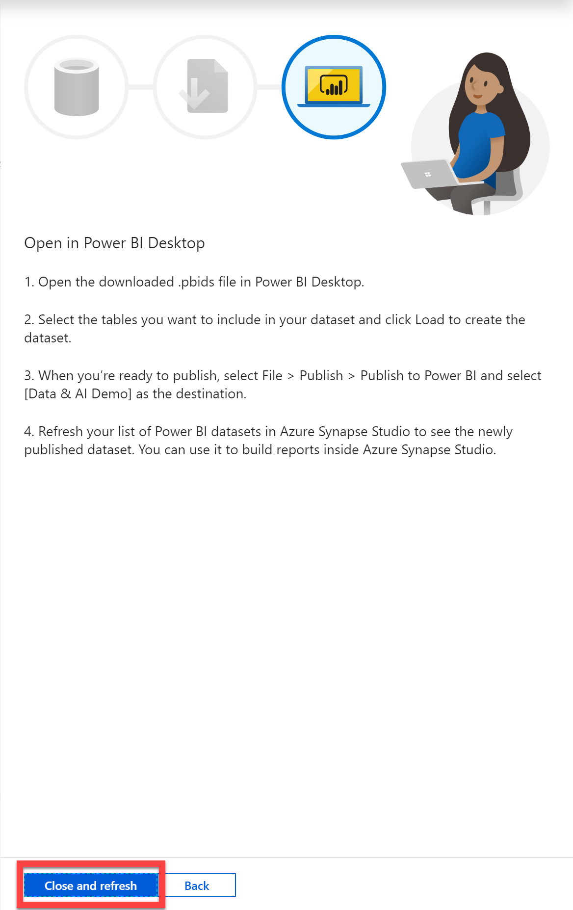

# Exercise 3 - Power BI integration

In this exercise, you will create a Power BI Report and build a visualization within Synapse Analytics Studio.

The Power BI Workspace has alreadby been created for you.

## Task 1 - Create a Power BI dataset in Synapse
In this task, you will use Power BI Desktop to create the dataset used by the report.

1. Open Synapse Analytics Studio, and then navigate to the `Develop hub`.
2. Expand **Power BI** and then select **Power BI datasets**.

    

3. Select **New Power BI dataset** within the panel that appears.

    

4. In the panel that appears, if a prompt appears to Install Power BI Desktop, click Start. 

    

5. In the step by step dialog that appears, hover over your SQL Pool and select the link that appears labeled **Download .pbids file**. 

    

6. Open the downloaded .pbid file that was downloaded. This will launch Power BI desktop.

7.  When Power BI Desktop loads, select **Microsoft account**, then select **Sign in**. Follow the login prompts to login with the credential provided to you. When you return to the SQL Server database dialog, select **Connect**.

    

8.  In the Navigator dialog, within the list of tables select **wwi.FactSale**, confirm the preview shows some data and then select Load.

    

9.  When prompted, set the query type to **Direct Query** and select **OK**.

    

10. From the **File** menu, select **Publish** and then select **Publish to Power BI**. If prompted to save your changes, select Save and provide a unique name for your file. This will also be the name used for the dataset.

    

11. In the dialog that appears, select the provided Power BI workspace (it should be the second option in the list). Do not select the item labeled My workspace. Choose **Select**.

    

12. Return to your browser where you have Azure Synapse Studio open. Select **Close and refresh** in the New Power BI dataset dialog that should still be open.

    

13. You should see your new Power BI dataset appear in the listing on the Power BI datasets panel. If not, select **Refresh**.

    

## Task 2 - Create a Power BI report in Synapse
In this task, you will use the dataset you published to create a new Power BI report within Synapse Analytics Studio. 

1. Open Synapse Analytics Studio, and then navigate to the `Develop hub`.
2. Expand **Power BI** and then select **Power BI datasets**.
3. Select your newly created dataset within the panel that appears. When you hover over the dataset, and button for creating a New Power BI report will appear. Select that.
4. This will launch a new tabbed document with the Power BI report designer. Also note, that your new report appears under the Power BI reports folder in the `Develop hub`.
5. Within the Power BI designer, under Fields, select the fields **SalespersonKey** and **TotalExcludingTax**.
6. Under the Visualizations, drag the **SalespersonKey** field and drop it into the **Legend** field.
7. Under Visualizations, select the `100% Stacked column chart` visualization. You should now have a chart that lets you quickly assess each sales person's contribution to the total.
8. From the file menu within the designer, select **Save As**. 
9. In the dialog that appears, provide a unique name for your report and then select **Save**.
10. This report is now available to all authorized users within Synsapse Analytics Studio and the Power BI workspace. 