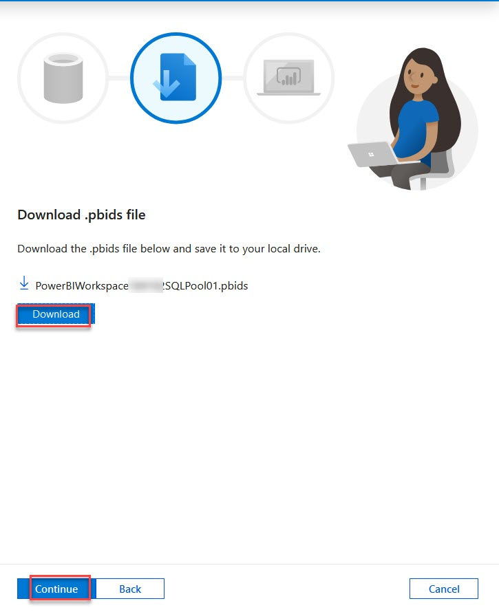
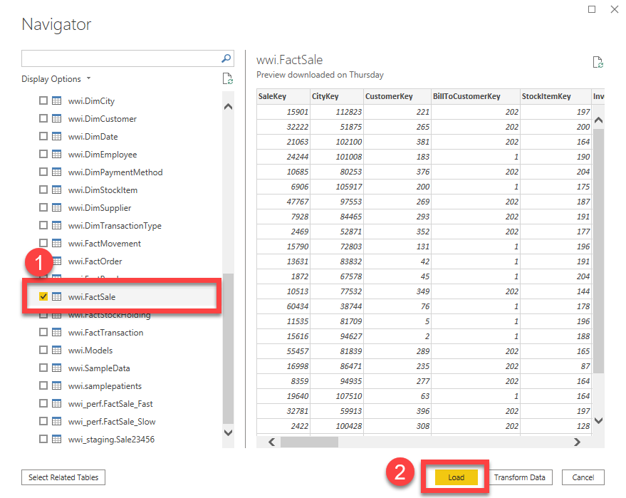
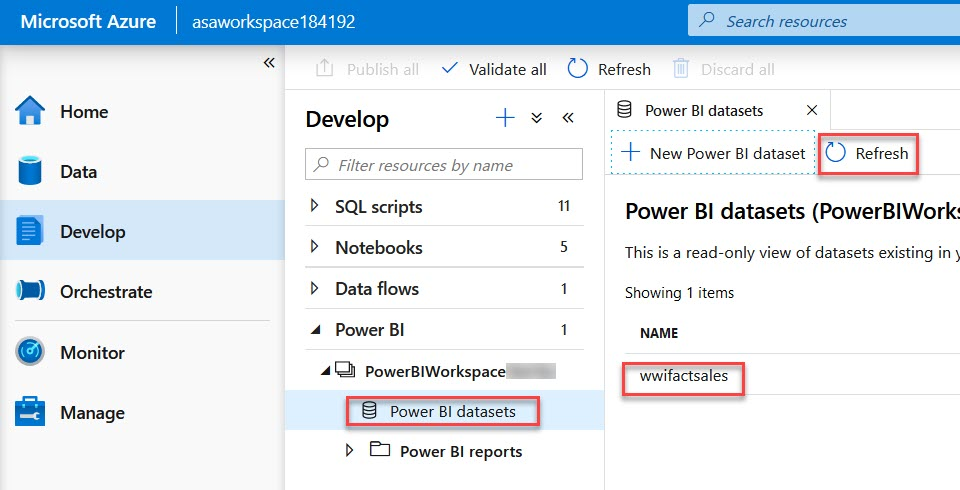
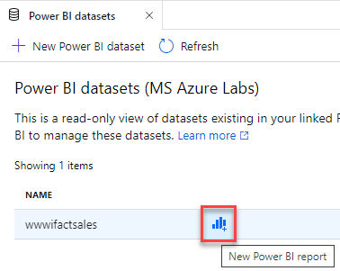
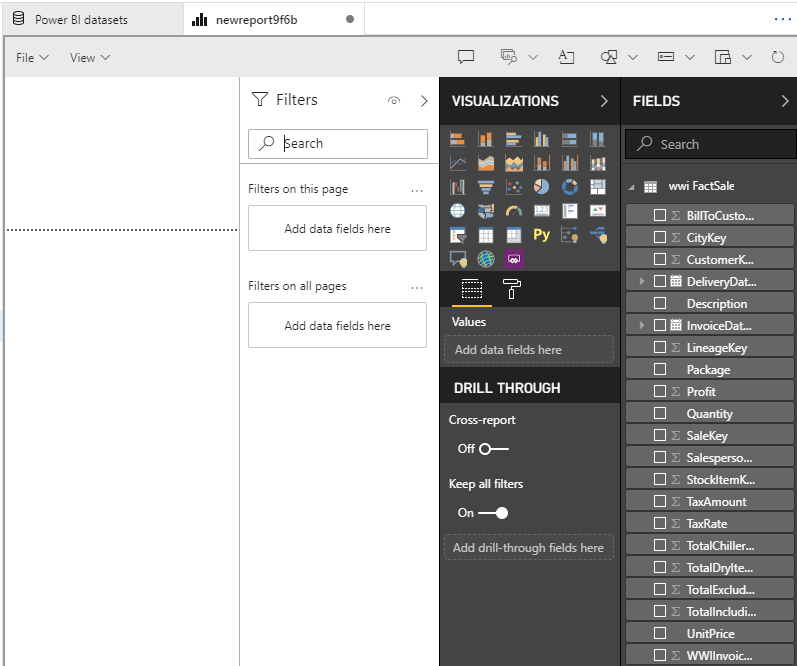
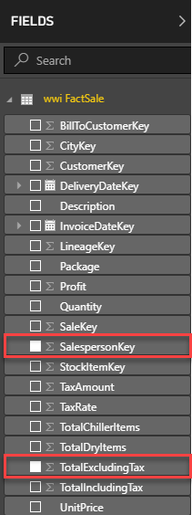
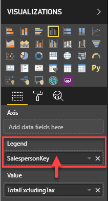
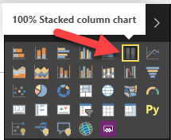
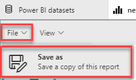

# Exercise 3 - Power BI integration

In this exercise, you will realize another benefit of the fully integrated environment provided by Azure Synapse Analytics. Here, you will create a Power BI Report and build a visualization within Synapse Analytics Studio. Once you have published a dataset, you will not have to leave this environment to log into a separate Power BI web site in order to view and edit reports.

The Power BI Workspace has already been created for you.

The tasks you will perform in this exercise are:

- Exercise 3 - Power BI integration
  - Task 1 - Create a Power BI dataset in Synapse
  - Task 2 - Create a Power BI report in Synapse

---

**Important**:

In the tasks below, you will be asked to enter a unique identifier in several places. You can find your unique identifer by looking at the username you were provided for logging into the Azure portal. Your username is in the format `user-UNIQUEID@msazurelabs.onmicrosoft.com`, where the _UNIQUEID_ component looks like `A01`, `B22`, or `C04`, as examples.

Please locate this value and note it for the steps below.

---

## Task 1 - Create a Power BI dataset in Synapse

In this task, you will use Power BI Desktop to create the dataset used by the report.

1. Open Synapse Analytics Studio, and then navigate to the `Develop hub`.

2. Expand **Power BI**, expand the first node under it, and then select **Power BI datasets**.

   

3. Select **New Power BI dataset** within the panel that appears.

   

4. In the panel that appears, if a prompt appears to Install Power BI Desktop, select **Start**.

   

5. In the step by step dialog that appears, select your SQL Pool and then select **Continue**.

6. Select **Download** to download the suggested `pbids` file.

   

7. Open the downloaded .pbid file that was downloaded. This will launch Power BI desktop.

8. When Power BI Desktop loads, select **Microsoft account**, then select **Sign in**. Follow the login prompts to login with the credential provided to you. When you return to the SQL Server database dialog, select **Connect**.

   

9. In the Navigator dialog, within the list of tables select **wwi.FactSale**, confirm the preview shows some data and then select **Load**.

   

10. When prompted, set the query type to **Direct Query** and select **OK**.

    

11. From the **File** menu, select **Publish** and then select **Publish to Power BI**. If prompted to save your changes, select Save and provide `wwifactsales` as the name. This will also be the name used for the dataset. You may be prompted to login a second time. Follow the login prompts to login with the credentials provided to you.

    

12. In the dialog that appears, select the provided Power BI workspace (the first one that appears under the `Power BI` section in the `Develop` hub). Do not select the item labeled My workspace. Choose **Select**.

    

13. Return to your browser where you have Azure Synapse Studio open. Select **Close and refresh** in the New Power BI dataset dialog that should still be open.

    

14. You should see your new Power BI dataset appear in the listing on the Power BI datasets panel. If not, select **Refresh**.

    

## Task 2 - Create a Power BI report in Synapse

In this task, you will learn how to use a collaborative approach to create a new Power BI report within Synapse Analytics Studio. To do this, you will use a dataset that was not originally created by you.

1. Select the `wwifactsales` dataset within the panel that appears. When you hover over the dataset, a button for creating a new Power BI report will appear. Select that button.

   

2. This will launch a new tabbed document with the Power BI report designer. Also note, that your new report appears under the Power BI reports folder in the `Develop` hub.

   

3. Within the Power BI designer, under Fields, select the fields **SalespersonKey** and **TotalExcludingTax**.

   

4. Under the Visualizations, drag the **SalespersonKey** field and drop it into the **Legend** field.

   

5. Under Visualizations, select the `100% Stacked column chart` visualization. You should now have a chart that lets you quickly assess each sales person's contribution to the total.

   

6. From the file menu within the designer, select **Save As**.

   

7. In the dialog that appears, provide a unique name for your report that included your _UNIQUEID_ from your username (e.g., `keysalesA03`) and then select **Save**.

   

8. This report is now available to all authorized users within Synapse Analytics Studio and the Power BI workspace.
